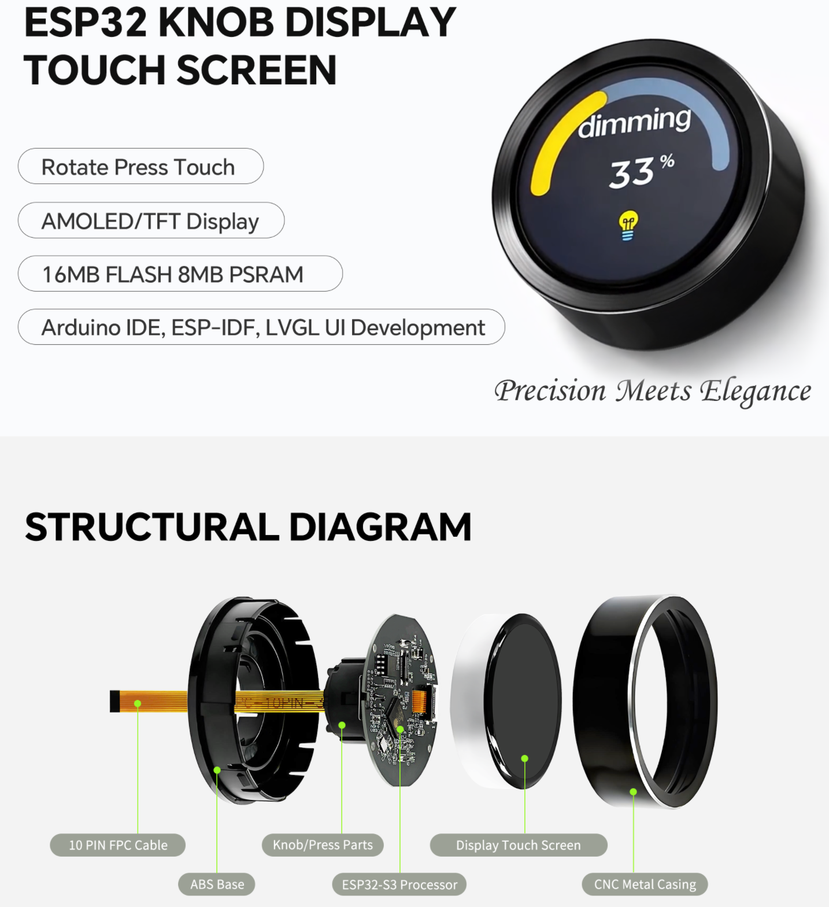

<h1 align = "center">UEDX46460015-MD50ESP32-1.5inch-Touch-Knob-Display</h1>

 * **English | [中文](./README_CN.md)**

    

-   **UEDX46460015-MD50ET**
    ---
    The **Smart Knob Display** powered by **ESP32-S3**.  
    Featuring a 1.5-inch **466x466** AMOLED Display (QSPI), capacitive touch, rotary encoder and button.  
    Ideal for IoT control panels, smart home devices and industrial HMI.

## 1. Introduction

The **UEDX46460015-MD50ET** is a compact smart display module designed for knob‑style HMI applications.  
It combines a 1.5‑inch AMOLED display (466×466 pixels) with a capacitive touch panel, a rotary encoder and a hardware button.

Powered by the **ESP32‑S3‑R8** (16 MB Flash, 8 MB Octal PSRAM), it provides Wi‑Fi and Bluetooth 5 (LE) connectivity, and supports development with **Arduino**, **ESP‑IDF** and **PlatformIO**.

### 1.1 Product Features

* **Processor**:
    * **ESP32-S3**: Xtensa® Dual‑Core 32‑bit LX7 MCU @ 240 MHz.
    * Integrated 2.4 GHz Wi‑Fi (802.11 b/g/n) & Bluetooth 5 (LE).
* **Memory**:
    * **16 MB** Quad SPI Flash.
    * **8 MB** Octal SPI PSRAM.
* **Display & Touch**:
    * **Screen**: 1.5‑inch IPS AMOLED (466×466 Resolution).
    * **Interface**: QSPI.
    * **Driver IC**: CO5300AF‑42.
    * **Touch**: Capacitive Multi‑Touch (CST820) via I²C.
* **Peripherals**:
    * **Encoder**: Rotary encoder (PHA/PHB) for precise knob input.
    * **Button**: Hardware button (shared with BOOT).
    * **Connectivity**: USB‑C (USB/UART for programming and debugging), UART expansion (FPC).
    * **Expansion FPC**: Extra GPIO, 5V, GND, UART0.

### 1.2 Applications

* Smart Home Control Knobs
* Industrial Knob‑based HMI
* IoT Device Dials
* Wearable / Compact User Interfaces

---

## 2. Hardware Description

### 2.1 Module Overview

The main functional blocks of the board are:

| Component | Description |
| :--- | :--- |
| **ESP32‑S3‑R8** | Main SoC (16 MB Flash / 8 MB Octal PSRAM). |
| **1.5" AMOLED** | 466×466 pixel display driven by QSPI (CO5300AF‑42). |
| **CST820** | Capacitive touch controller (I²C). |
| **Rotary Encoder** | 2‑phase encoder (PHA/PHB) for knob rotation. |
| **Button** | BOOT button (also used for firmware download). |
| **USB‑C** | Programming, debug (UART via USB) and power (5V). |
| **FPC Connector** | Additional power, UART0 and UART2 signals. |

### 2.2 GPIO Definition (Pinout)

#### **Display (QSPI)**
| Display Pin | ESP32‑S3 Pin |
| :---: | :---: |
| CS | IO12 |
| PCLK | IO10 |
| DATA0 | IO13 |
| DATA1 | IO11 |
| DATA2 | IO14 |
| DATA3 | IO9 |
| RST | IO8 |
| BACKLIGHT | IO17 |

#### **Touch (CST820)**
| Touch Pin | ESP32‑S3 Pin |
| :---: | :---: |
| SDA | IO0 |
| SCL | IO1 |
| RST | IO3 |
| INT | IO4 |

#### **Button**
| Button Pin | ESP32‑S3 Pin |
| :---: | :---: |
| BOOT | IO0 |

#### **Encoder**
| Encoder Pin | ESP32‑S3 Pin |
| :---: | :---: |
| PHA | IO6 |
| PHB | IO5 |

#### **USB / UART**
| USB/UART Pin | ESP32‑S3 Pin |
| :---: | :---: |
| USB‑DN | IO19 |
| USB‑DP | IO20 |

#### **FPC Connector Pinout**
| FPC Pin | Adapter Signal | ESP32‑S3 Pin |
| :---: | :--- | :--- |
| 1 | 5V | 5V |
| 2 | PB7 | – |
| 3 | GND | GND |
| 4 | RX2 | GPIO40 |
| 5 | TX2 | GPIO39 |
| 6 | RX1 | U0RXD / GPIO44 |
| 7 | TX1 | U0TXD / GPIO43 |
| 8 | NC | CHIP‑EN |
| 9 | D+ (USB‑DP) | GPIO20 |
|10 | D‑ (USB‑DN) | GPIO19 |

### 2.3 Mechanical Dimensions

Refer to the product specification sheet for detailed dimensions.

---

## 3. Software

We provide comprehensive support for **Arduino**, **PlatformIO**, and **ESP‑IDF** frameworks, with pre‑ported **LVGL** examples.

### 3.1 Software Examples

Examples are available in the [GitHub Repository](https://github.com/VIEWESMART/ESP32-1.5inch-AMOLED-Knob) (examples folder).

| Framework | Example Path | Description |
| :---: | :--- | :--- |
| **Arduino** | `examples/arduino/gui/lvgl_v8` | **LVGL Benchmark**: Usage example of LVGL v8. Can be opened directly in Arduino IDE. |
| **ESP‑IDF** | `examples/esp_idf` | **LVGL port**: Example of porting and using LVGL in ESP‑IDF. |
| **PlatformIO** | `examples/platformio/lvgl_v8_port` | **LVGL v8 port**: Usage example of LVGL v8. |

### 3.2 Getting Started

#### 3.2.1 Preparation

* **Hardware**: UEDX46460015‑MD50ET Board, USB‑C Cable.
* **Software**: VS Code (ESP‑IDF v5.3+) or Arduino IDE (v2.0+) or VS Code (PlatformIO).
* **Libraries**: The following libraries are required for Arduino IDE and PlatformIO.

| Library | Version | Description |
| :--- | :--- | :--- |
| `ESP32_Display_Panel` | `1.0.3+` | By Espressif. Necessary to drive the screen. |
| `ESP32_IO_Expander` | *Arduino auto selection* | Dependency of `ESP32_Display_Panel`. |
| `esp-lib-utils` | *Arduino auto selection* | Dependency of `ESP32_Display_Panel`. |
| `lvgl` | `8.4.0` | Open‑source embedded graphics library. |

#### 3.2.2 ESP‑IDF Setup

1.  **Open the example**  
    * Download the repository from GitHub (click the green "Code" button and select "Download ZIP", or clone it).  
    * Open the example folder (e.g., `examples/esp_idf`) using VS Code with the ESP‑IDF extension.

2.  **Compile and upload**  
    * Click the **build** icon to compile the project.  
    * Connect the board via USB‑C.  
    * Click the **upload** icon to flash the firmware.

#### 3.2.3 Arduino Setup([Novice tutorial](https://github.com/VIEWESMART/VIEWE-Tutorial/blob/main/Arduino%20Tutorial/Arduino%20Getting%20Started%20Tutorial.md))

1.  **Install Arduino IDE**  
    * Download and install the [Arduino IDE](https://www.arduino.cc/en/software) (v2.0+ recommended).

2.  **Install ESP32 Board Package**  
    * Open Arduino IDE and go to **File > Preferences**.  
    * Add the following URL in “Additional boards manager URLs”:  
      `https://espressif.github.io/arduino-esp32/package_esp32_index.json`  
    * Go to **Tools > Board > Boards Manager**, search for `esp32` by Espressif and install version **3.0.0+**.

3.  **Install Libraries**  
    * Go to **Sketch > Include Library > Library Manager**.  
    * Search for `ESP32_Display_Panel` by Espressif and install version **1.0.3+**. When prompted, click **INSTALL ALL** to install the dependencies.  
    * Install `lvgl` (version **8.4.0**).

4.  **Open Example**  
    * Navigate to **File > Examples > ESP32_Display_Panel**.  
    * Select **Arduino > gui > lvgl_v8 > simple_port**.

5.  **Select Board**  
    * Target: **ESP32S3 Dev Module**.  
    * Configure the following settings:
        * **Flash Size**: 16MB (128Mb)
        * **Partition Scheme**: 16M Flash (3MB APP/9.9MB FATFS)
        * **PSRAM**: **OPI PSRAM** (this is critical)

6.  **Configure the Supported Board**  
    * In the example, open the file `esp_panel_board_supported_conf.h`.  
    * Set the macro `ESP_PANEL_BOARD_DEFAULT_USE_SUPPORTED` to `1`.  
    * Locate the line `// #define BOARD_VIEWE_UEDX46460015_MD50ET` and uncomment it by removing the `//`.  
    * Ensure no other board definition is enabled at the same time.

7.  **Interface‑Specific Configuration**  
    * Since the board uses a **QSPI** interface, open `lv_conf.h` (or the example’s `lv_conf.h` equivalent) and set `LV_COLOR_16_SWAP` to `1`.  
    * **Do not** modify `LVGL_PORT_AVOID_TEARING_MODE` or `LVGL_PORT_ROTATION_DEGREE` (they are only relevant for RGB/MIPI displays).

8.  **Select Port and Upload**  
    * Connect the board, then go to **Tools > Port** and select the correct COM port.  
    * Click the **Verify** (✓) button to compile.  
    * Click the **Upload** (→) button to flash.

> [!TIP]
> **Configuration Tips**  
> * In `esp_panel_board_supported_conf.h`, ensure you uncomment: `#define BOARD_VIEWE_UEDX46460015_MD50ET`.  
> * Do not enable both `ESP_PANEL_BOARD_DEFAULT_USE_SUPPORTED` and `ESP_PANEL_BOARD_DEFAULT_USE_CUSTOM`.  
> * You cannot enable multiple board definitions at the same time.

#### 3.2.4 PlatformIO Setup

1.  **Open the example**  
    * Download the repository and open the `examples/platformio/lvgl_v8_port` folder in VS Code with the PlatformIO extension.

2.  **Select the Board Environment**  
    * Open the `platformio.ini` file.  
    * Change the `default_envs` line to `BOARD_VIEWE_UEDX46460015_MD50ET`.

3.  **Configure the Example**  
    * (QSPI interface) In `lv_conf.h`, set `LV_COLOR_16_SWAP` to `1`.  
    * Leave `LVGL_PORT_AVOID_TEARING_MODE` and `LVGL_PORT_ROTATION_DEGREE` untouched.

4.  **Compile and Upload**  
    * Click the **✓** (Compile) button.  
    * Connect the board, then click the **→** (Upload) button.
      
### 3.3 Firmware Download (Manual Flash)

If you need to flash a pre‑compiled binary manually:

1.  Open the “Flash Download Tool” (available in the tools folder or from Espressif’s website).
2.  Select the chip type (**ESP32‑S3**) and the correct download method.
3.  Load the firmware files from the `firmware` folder and configure the offsets as described in the firmware readme.
4.  Connect the board and start the download.  
    *If flashing fails, hold down the **BOOT** button while powering on, then retry.*

    
    

## FAQ

* Q. After reading the above tutorials, I still don't know how to build a programming environment. What should I do?
* A. If you still don't understand how to build an environment after reading the above tutorials, you can refer to the [VIEWE-FAQ]() document instructions to build it.

 

* Q. Why does Arduino IDE prompt me to update library files when I open it? Should I update them or not?
* A. Choose not to update library files. Different versions of library files may not be mutually compatible, so it is not recommended to update library files.

 

* Q. Why is there no serial data output on the "Uart" interface on my board? Is it defective and unusable?
* A. The default project configuration uses the USB interface as Uart0 serial output for debugging purposes. The "Uart" interface is connected to Uart0, so it won't output any data without configuration. For PlatformIO users, please open the project file "platformio.ini" and modify the option under "build_flags = xxx" from "-D ARDUINO_USB_CDC_ON_BOOT=true" to "-D ARDUINO_USB_CDC_ON_BOOT=false" to enable external "Uart" interface. For Arduino users, open the "Tools" menu and select "USB CDC On Boot: Disabled" to enable the external "Uart" interface.

 

* Q. Why is my board continuously failing to download the program?
* A. Please hold down the "BOOT" button and try downloading the program again.

## Schematic

    

## Information
[products specification](information/UEDX48480021-MD80E%20V3.3%20SPEC.pdf)

[Display Datasheet](information/UE021WV-RB40-L002B.pdf)

[button](information/6x6Silent%20switch.pdf)

[Encoder](information/C219783_%E6%97%8B%E8%BD%AC%E7%BC%96%E7%A0%81%E5%99%A8_EC28A1520401_%E8%A7%84%E6%A0%BC%E4%B9%A6_WJ239718.PDF)

## DependentLibraries
* [ESP32_Display_Panel>0.2.1](https://github.com/esp-arduino-libs/ESP32_Display_Panel) (Please [download](./Libraries/ESP32_Display_Panel) the library first as the latest version has not been released yet)
* [ESP32_IO_Expander](https://github.com/esp-arduino-libs/ESP32_IO_Expander) (Please [download](./Libraries/ESP32_IO_Expander) the library first as the latest version has not been released yet)
* [ESP32_Button](https://github.com/esp-arduino-libs/ESP32_Button)
* [ESP32_Knob](https://github.com/esp-arduino-libs/ESP32_Knob)
* [lvgl-8.4.0](https://lvgl.io)

